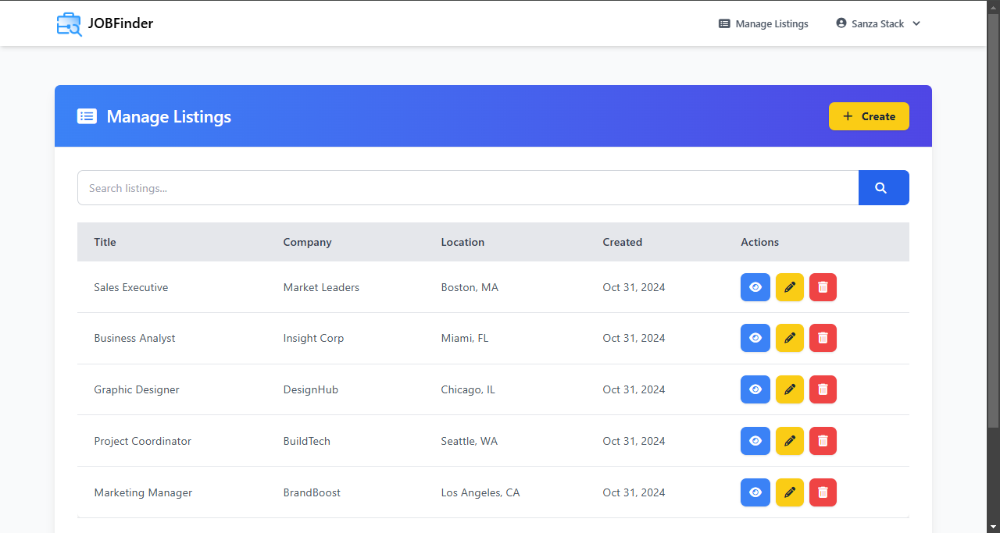
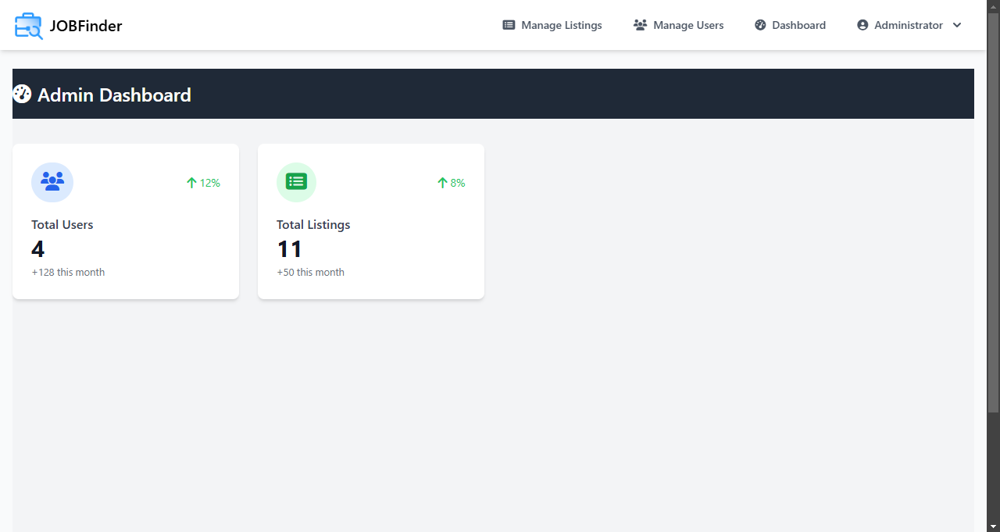
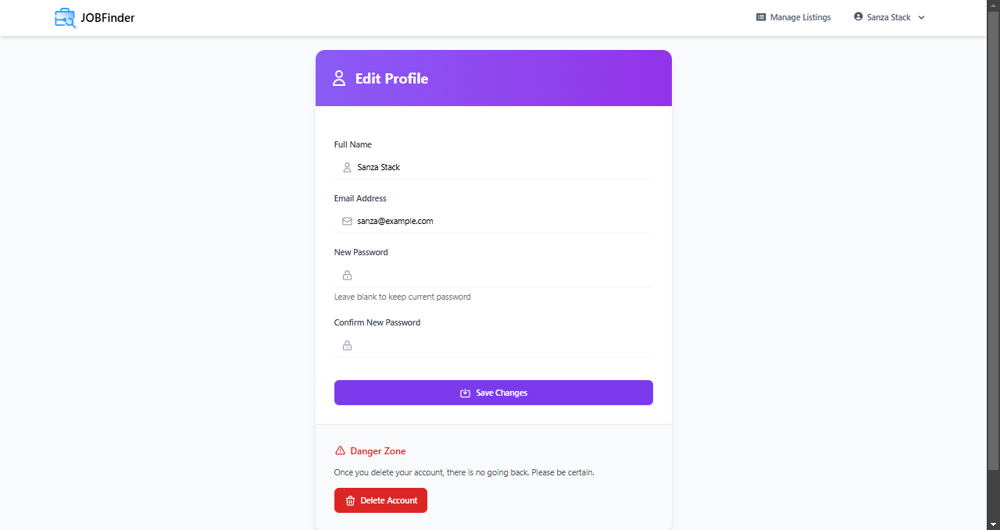
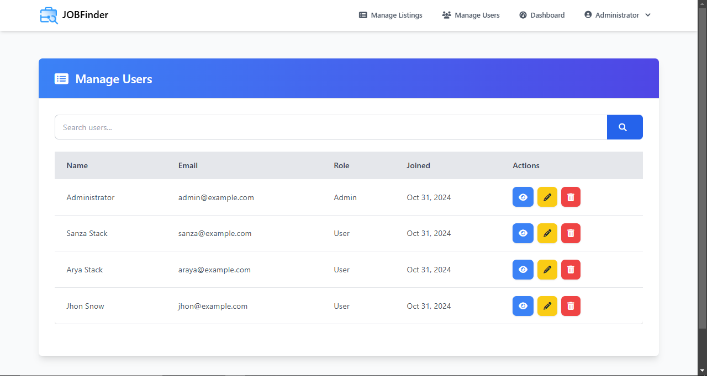
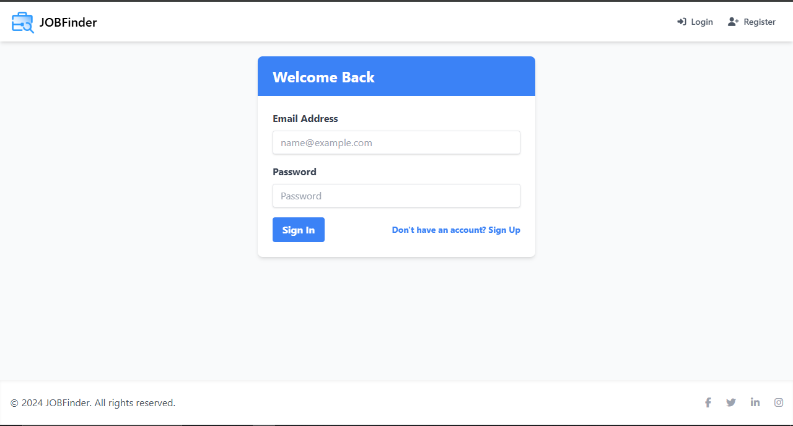
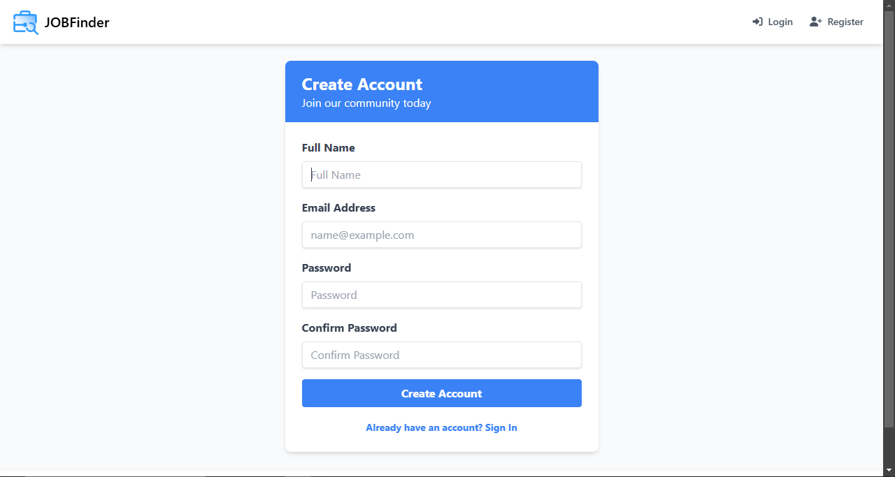

# 🌟 JobFinder: Professional Job Listing Platform

---

## Overview

JobFinder is a powerful Laravel-based web application tailored for job seekers and employers. With a modern interface and user-friendly features, JobFinder offers an intuitive experience for posting and searching for jobs, while giving administrators comprehensive tools to manage platform content and users.

---

## 🚀 Key Features

### User Experience
- **🔐 Secure Authentication & Profile Management:** Register, log in, and manage your profile securely.
- **📋 Job Posting & Management:** Post, edit, and manage your job listings with ease.
- **🔍 Advanced Job Search:** Find job listings quickly using search filters.
- **👤 Admin Dashboard:** Centralized dashboard for tracking users and listings.

### Administrator Capabilities
- **🛡️ Platform Oversight:** Admin control panel for managing all users and job listings.
- **📊 Analytics:** Track user activity and job listing performance.
- **🚧 Content Moderation Tools:** Admin tools for removing or editing inappropriate content.

---

## 🖥️ Technology Stack

### Backend
- **Framework:** Laravel 10.x
- **Authentication:** Laravel Breeze for secure login/logout
- **ORM:** Eloquent for database interactions
- **Queue Management:** Laravel Queue for handling background tasks

### Frontend
- **Styling:** Tailwind CSS for a modern, responsive design
- **Icons:** Heroicons and FontAwesome for clean, intuitive icons

### Database
- **Primary:** MySQL

### Development Tools
- **Package Management:** Composer and NPM
- **Build Tools:** Vite
- **Version Control:** Git

---

## 📦 Prerequisites

- PHP 8.1+
- Composer
- Node.js 16+

---

## 🛠️ Installation Guide

### 1. Clone the Repository
```bash
git clone https://github.com/lahiruanushka/laravel-job-posting-app.git
cd laravel-job-posting-app
```

### 2. Install Dependencies
```bash
composer install
npm install
npm run build
```

### 3. Environment Configuration
```bash
cp .env.example .env
php artisan key:generate
```
Update `.env` with your database and other configuration details.

### 4. Database Setup
```bash
php artisan migrate:fresh --seed
php artisan storage:link
```

### 5. Start Development Server
```bash
php artisan serve
npm run dev
```

---

## 🔒 Security Features

- **Role-based Access Control:** Separate permissions for users and administrators.
- **CSRF Protection:** Prevents cross-site request forgery.
- **XSS Prevention:** Input sanitization to prevent attacks.
- **Secure Password Hashing:** Protects user passwords with hashing.

---

## 📸 Screenshots

1. **Homepage**
   

2. **Manage Job Listings**
   

3. **Admin Dashboard**
   

4. **Job Listing Page**
   

5. **User Profile Management**
   

6. **Manage Users**
   

7. **Login**
   

9. **Register**
   
